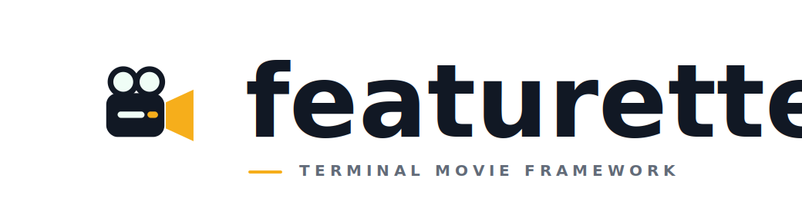

<p align="center">
  
</p>

<p align="center">
  A TypeScript framework for making short films that run in the terminal.
</p>

<p align="center">
  <a href="#install">Install</a>
  <span> · </span>
  <a href="#example">Example</a>
  <span> · </span>
  <a href="#model">Model</a>
  <span> · </span>
  <a href="#features">Features</a>
  <span> · </span>
  <a href="./USAGE.md">Usage</a>
</p>

<br />

## Install

```sh
npm install featurette
```

Featurette ships ESM and CommonJS entry points and requires Node.js 20.19 or newer.

## Example

```ts
import { defineFilm, play } from 'featurette';

const film = defineFilm({
    title: 'Signal',
    minSize: { columns: 60, rows: 18 },
    voices: {
        process: { fg: '#f6ae1b', speed: 55 },
    },
});

film.scene('wake', async ($) => {
    await $.clear();

    await $.type('hello?', {
        at: $.center().up(1),
        voice: 'process',
    });

    await $.beat(800);

    await $.type('oh. you ran me.', {
        at: $.center().down(1),
        voice: 'process',
    });
});

await play(film);
```

## Model

A film is an ordered set of async scenes. Inside each scene, `$` is the stage: write text, compose layers, schedule effects, and respond to input. Featurette handles rendering, timing, playback, and terminal cleanup underneath.

## Features

```txt
scenes, beats, voices, and layers
terminal-aware drawing and motion
cinematic and developer-native effects
input, interruption, and live resize
transcript and reduced-motion fallbacks
deterministic scene rendering for tests
ESM and CommonJS
zero runtime dependencies
```

## Usage

See [`USAGE.md`](./USAGE.md) for composition, effects, motion, input, playback flags, and testing.

## License

Licensed under the [MIT License](./LICENSE).
